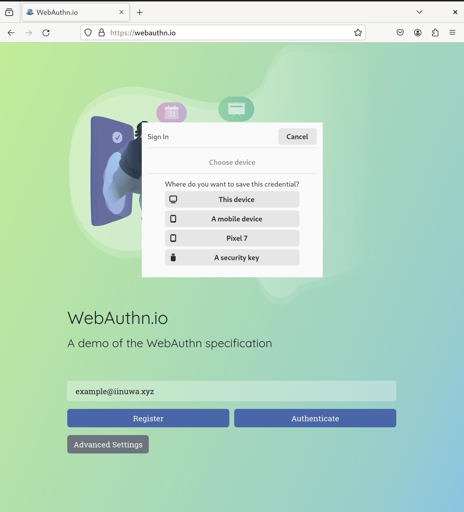
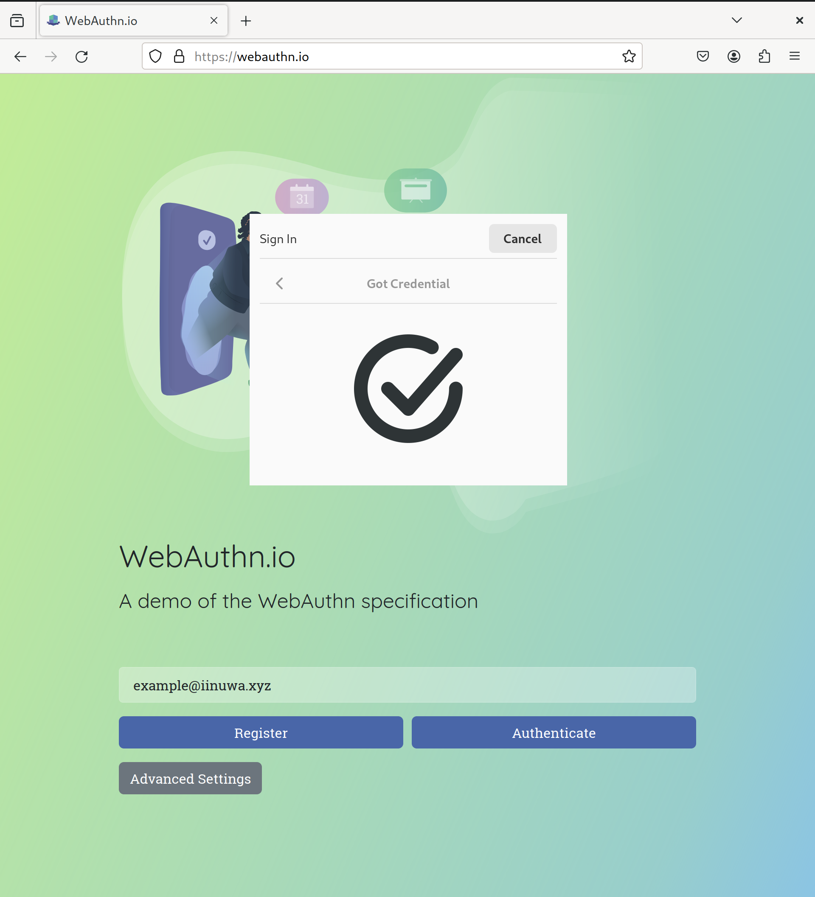
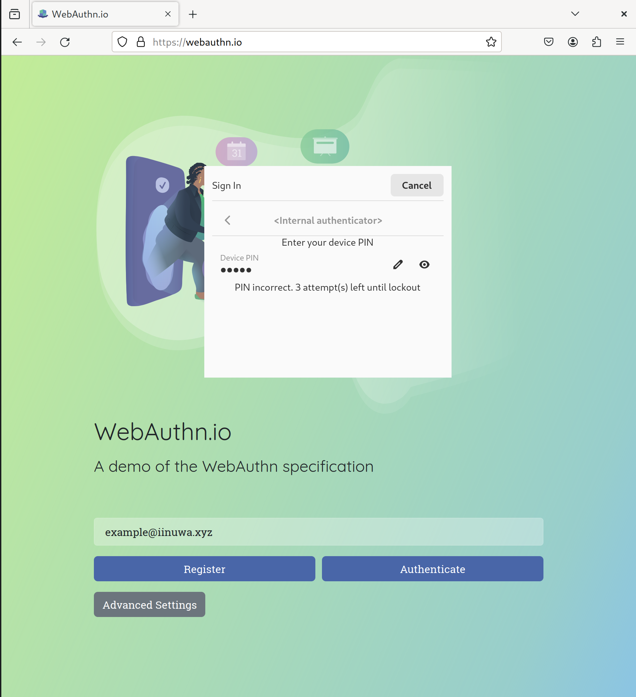
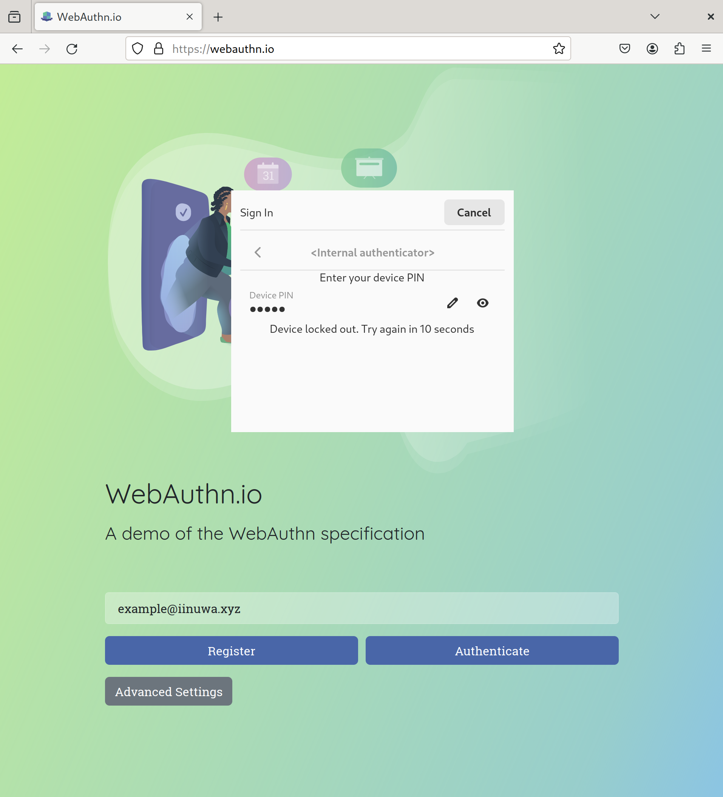
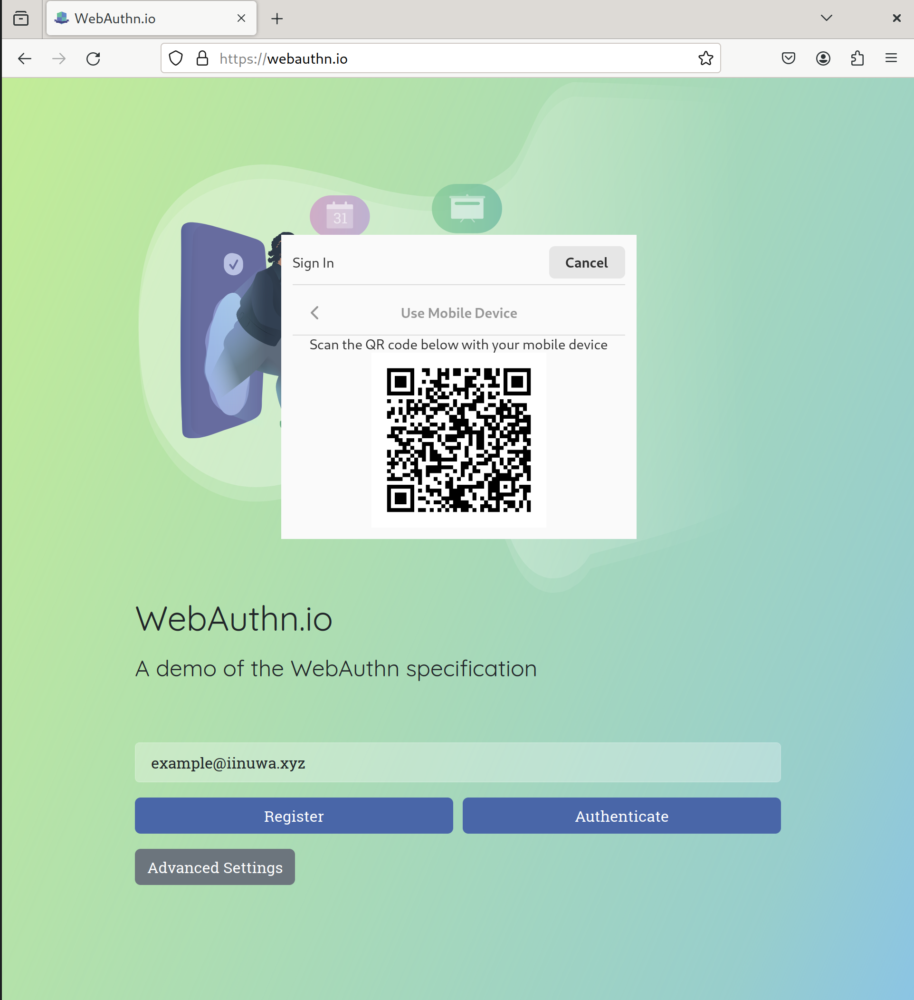
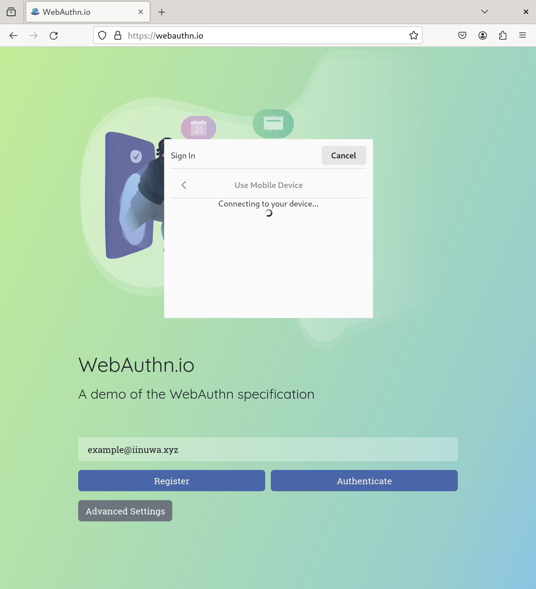
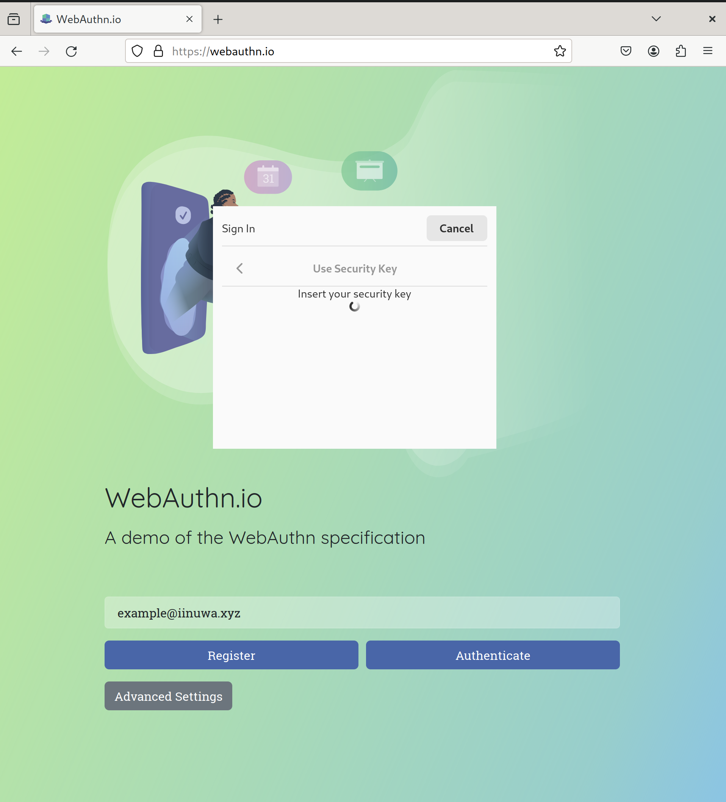
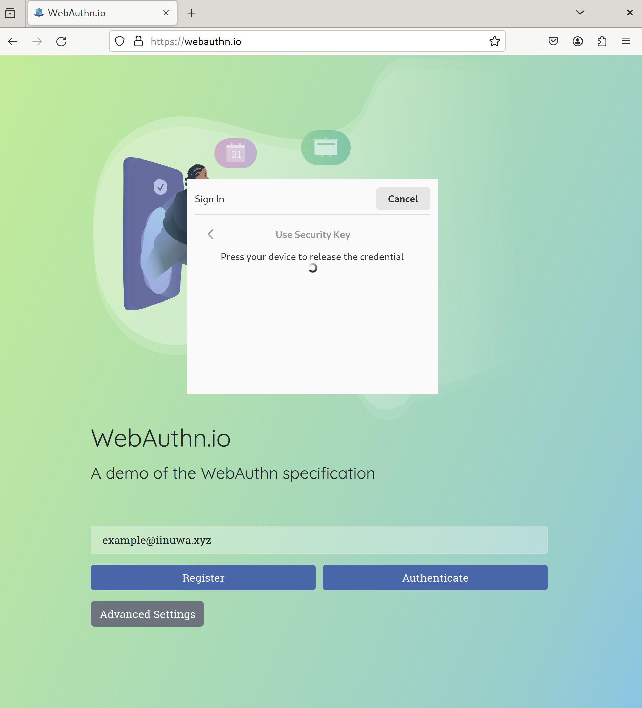

# credentialsd

A Linux Credential Manager API.

(Previously called `linux-webauthn-platform-api`.)

## Goals

The primary goal of this project is to provide a spec and reference
implementation of an API to mediate access to web credentials, initially local
and remote FIDO2 authenticators. See [GOALS.md](/GOALS.md) for more information.

## How to install

### From packages

We have [precompiled RPM packages for Fedora and openSUSE][obs-packages] hosted
by the Open Build Service (OBS). We also copy these for released versions to the
[release page][release-page].

There are several sub-packages:

- `credentialsd`: The core credential service
- `credentialsd-ui`: The reference implementation of the UI component for
  credentialsd.
- `credentialsd-webextension`: Binaries and manifest files required for the
  Firefox add-on to function

[obs-packages]: https://build.opensuse.org/package/show/home:MSirringhaus:webauthn_devel/credentialsd
[release-page]: https://github.com/linux-credentials/credentialsd/releases

### From source

Alternatively, you can build the project yourself using the instructions in
[BUILDING.md](/BUILDING.md).

## How to use

Right now, there are three ways to use this service.

### Experimental Browser Extension

There is a browser extension that allows you to test `credentialsd` without a
custom browser build. It overrides `navigator.credentials.create()` and
`navigator.credentials.get()` to route WebAuthn requests through the
credentialsd D-Bus service.

Two browsers are supported from a single unified codebase:

- **Firefox 140+** — The Mozilla-signed XPI is distributed only through
  [GitHub Releases](https://github.com/PLFJY/credentialsd/releases/latest).
  Install the native-side Linux package first
  (`packaging/credentialsd-firefox-sidecar-git`), then download the signed XPI
  from the latest Release and install it via
  `about:addons → gear menu → Install Add-on From File…`. `makepkg -si` does
  not install the Firefox extension; it installs only the native Linux
  integration. Runtime privacy details are in [PRIVACY.md](/PRIVACY.md).
- **Edge/Chromium (Chrome 111+, Edge 111+)** — Load as an unpacked extension
  from `webext/add-on/` using the Chromium manifest. See
  [`webext/README.md`](/webext/README.md#for-development-edgechromium) for
  setup instructions.

The extension currently matches all HTTPS pages (`https://*/*`). Origin
validation is performed by the credentialsd daemon and does not rely on the
extension's match pattern. See
[SIDECAR-DEPLOY.md](/SIDECAR-DEPLOY.md) for the full sidecar deployment,
publishing, and automatic-update documentation.

### Experimental Firefox Build

There is also an experimental Firefox build that contains a patch to interact
with `credentialsd` directly without an add-on. You can access a
[Flatpak package for it on OBS][firefox-patch-flatpak] as well.

[firefox-patch-flatpak]: https://download.opensuse.org/repositories/home:/MSirringhaus:/webauthn_devel/openSUSE_Factory_flatpak/

## Contributing

We welcome contributions! See [CONTRIBUTING.md](/CONTRIBUTING.md) for details.

Join the discussion on Matrix at `#credentials-for-linux:matrix.org`.

## Mockups

Here are some mockups of what this would look like for a user:

### Internal platform authenticator flow (device PIN)

Alternatively, lock out the credential based on incorrect attempts.

### Hybrid credential flow

### Security key flow

## Related projects:

- https://github.com/linux-credentials/libwebauthn (previously https://github.com/AlfioEmanueleFresta/xdg-credentials-portal)
- authenticator-rs
- webauthn-rs

# Security Policy

See [SECURITY.md](/SECURITY.md) for our security policy.

# License

See the [LICENSE.md](/LICENSE.md) file for license rights and limitations (LGPL-3.0-only).
